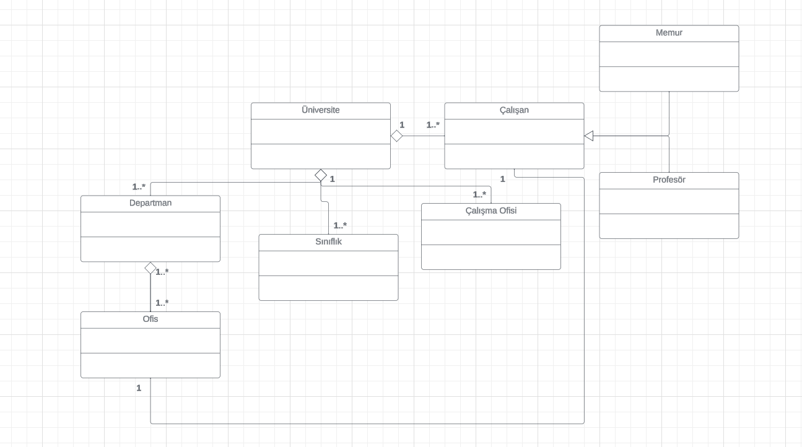

# Patika OOP (Object Oriented Programming) Dersi Üniversite Yönetim Sistemi UML Diyagram Projesi

Üniversite Yönetim Sistemi UML Diyagram Projesinin Linki

[Proje Diyagramına Git](https://lucid.app/lucidchart/bcf10638-0c76-4954-a832-972cf4065a32/edit?viewport_loc=-180%2C-229%2C2560%2C1184%2C0_0&invitationId=inv_de3577cb-eabe-4d9a-bc18-e70426f7d9f0)

Proje Diyagramı Görselleri

